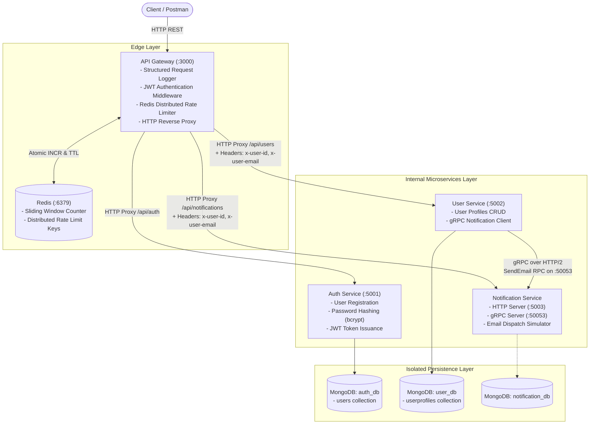

# Microservices API Gateway Platform

A modular microservices backend architecture built with **Node.js**, **Express**, **MongoDB**, **Redis**, **gRPC**, and **Docker**.

This platform demonstrates core distributed systems patterns including reverse proxy routing, centralized JWT authentication, distributed Redis-backed rate limiting, database-per-service data isolation, synchronous inter-service gRPC communication via Protocol Buffers, and non-root containerization.

---

## Table of Contents

- [1. Project Overview](#1-project-overview)
- [2. Problem Being Solved](#2-problem-being-solved)
- [3. Why Microservices](#3-why-microservices)
- [4. System Architecture](#4-system-architecture)
- [5. Architecture Diagram](#5-architecture-diagram)
- [6. Services and Responsibilities](#6-services-and-responsibilities)
- [7. API Gateway Implementation](#7-api-gateway-implementation)
- [8. JWT Authentication & Identity Propagation](#8-jwt-authentication--identity-propagation)
- [9. gRPC Inter-Service Communication](#9-grpc-inter-service-communication)
- [10. Redis Rate Limiting](#10-redis-rate-limiting)
- [11. MongoDB Data Ownership (Database-Per-Service)](#11-mongodb-data-ownership-database-per-service)
- [12. Docker Containerization](#12-docker-containerization)
- [13. Project Folder Structure](#13-project-folder-structure)
- [14. Environment Variables](#14-environment-variables)
- [15. How to Run Locally](#15-how-to-run-locally)
- [16. How to Run with Docker Compose](#16-how-to-run-with-docker-compose)
- [17. API Endpoints](#17-api-endpoints)
- [18. Example Request Flows](#18-example-request-flows)
- [19. Future Improvements](#19-future-improvements)

---

## 1. Project Overview

The **Microservices API Gateway Platform** is an end-to-end distributed backend system where client applications communicate exclusively through a centralized **API Gateway**. Downstream microservices operate within an internal network, decoupling client clients from internal service topologies, network protocols, and data stores.

### Core Technologies
- **Runtime:** Node.js (v20 LTS, ES Modules)
- **Web Framework:** Express.js
- **Reverse Proxy:** `http-proxy-middleware`
- **Inter-Service RPC:** gRPC (`@grpc/grpc-js`, `@grpc/proto-loader`) with Protocol Buffers (`proto3`)
- **Primary Databases:** MongoDB (Mongoose ODM) with dedicated databases per service
- **Distributed Cache & State:** Redis (`ioredis`) for rate limiting counters
- **Security:** JSON Web Tokens (`jsonwebtoken`), password hashing with `bcryptjs`
- **Containerization:** Docker (`node:20-alpine`), Docker Compose

---

## 2. Problem Being Solved

In traditional monolithic web architectures:
1. **Single Point of Failure & Blast Radius:** A memory leak, crash, or heavy processing load in one module (e.g., notification generation) degrades or terminates the entire application.
2. **Coupled Data Models:** Different business concerns access the same database tables directly, causing schema tight-coupling, accidental data dependencies, and complex migrations.
3. **Client-Side Complexity:** Without an API Gateway, frontend applications must know the specific network host, port, protocol, and authentication mechanisms of every individual service.
4. **Duplicated Cross-Cutting Concerns:** Every internal service is forced to reimplement authentication verification, SSL termination, CORS handling, client IP rate limiting, and request logging.

This project addresses these challenges by decoupling domains into autonomous microservices, establishing strict database boundaries, delegating edge policies to a reverse-proxy Gateway, and utilizing high-performance gRPC for internal service-to-service calls.

---

## 3. Why Microservices

The architecture partitions business domains based on **Bounded Contexts** (Domain-Driven Design):

| Domain | Isolation Benefit |
| :--- | :--- |
| **Authentication (`auth-service`)** | High security domain. Password hashing (bcrypt) is CPU-bound; isolating it prevents CPU spikes during login bursts from starving profile or notification endpoints. |
| **User Profile (`user-service`)** | High read/write domain. Manages user profile information and can scale independently based on user browsing traffic. |
| **Notifications (`notification-service`)** | I/O-bound domain. Handles third-party dispatch (email/SMS). If downstream mail servers become slow or timeout, the caller service's event loop is protected. |

---

## 4. System Architecture

The architecture separates the platform into an **External Edge Layer**, an **Internal Services Network**, and a **Persistence Layer**:

1. **External Layer (Client to Gateway):** Clients (browsers, mobile apps, Postman) send standard HTTP REST requests to the API Gateway on port `3000`. No internal service exposes public ports directly to the outside internet in production.
2. **Edge Security & Routing:** The Gateway executes structured request logging, validates JWT tokens for protected routes, enforces Redis-backed rate limits, and proxies traffic to downstream services.
3. **Internal Synchronous Communication:** Services communicate with each other over internal network interfaces. While external clients communicate over HTTP/REST, the `user-service` communicates with the `notification-service` using binary **gRPC over HTTP/2**.
4. **Isolated Persistence:** Each service connects strictly to its own dedicated MongoDB database instance. Services never execute cross-database queries or touch foreign collections directly.

---

## 5. Architecture Diagram



---

## 6. Services and Responsibilities

### 1. API Gateway (`gateway/`)
- **Port:** `3000` (HTTP)
- **Role:** Single point of entry for all incoming traffic.
- **Responsibilities:**
  - Route reverse proxying using `http-proxy-middleware`.
  - Structured request logging (HTTP method, route, status code, latency in ms, client IP).
  - Centralized JWT verification for all protected paths.
  - User identity injection (`x-user-id`, `x-user-email`) into downstream proxy headers.
  - Distributed client IP and user-based rate limiting backed by Redis.
  - Gateway and Redis health checks via `GET /health`.

### 2. Auth Service (`auth-service/`)
- **Port:** `5001` (HTTP)
- **Database:** `auth_db`
- **Responsibilities:**
  - User registration (`POST /register`) with salt/hash via `bcryptjs`.
  - User login (`POST /login`) with credential validation.
  - Generation and signing of JWT tokens containing `userId` and `email`.
  - Self-contained protected verification check (`GET /protected`).

### 3. User Service (`user-service/`)
- **Port:** `5002` (HTTP)
- **Database:** `user_db`
- **Responsibilities:**
  - Profile retrieval (`GET /profile`, `GET /profile/:userId`, `GET /users/:userId`).
  - Profile updates and upserts (`PUT /profile`, `PUT /profile/:userId`).
  - Reads authenticated identity directly from the Gateway-injected `x-user-id` header.
  - Houses the **gRPC Client** that communicates with `notification-service`.
  - Exposes `POST /test-notification` to trigger internal gRPC calls.

### 4. Notification Service (`notification-service/`)
- **Ports:** `5003` (HTTP REST), `50053` (gRPC Server)
- **Database:** `notification_db`
- **Responsibilities:**
  - Implements the `NotificationService` gRPC service compiled from `notification.proto`.
  - Handles the `SendEmail` RPC method over binary HTTP/2 on port `50053`.
  - Simulates and logs dispatched emails (recipient, subject, message payload).
  - Exposes REST HTTP endpoints (`POST /send-email`) for direct REST notifications.

---

## 7. API Gateway Implementation

The API Gateway is built on Express and uses `http-proxy-middleware` to route client requests:

```
Client Request                Gateway Action                Downstream Target
--------------------------------------------------------------------------------------
POST /api/auth/*         ->   Rate Limit -> Proxy       ->  http://auth-service:5001
GET  /api/users/*        ->   JWT Auth -> Rate Limit    ->  http://user-service:5002/*
POST /api/notifications  ->   JWT Auth -> Rate Limit    ->  http://notification-service:5003/*
```

### Key Architectural Highlights:
- **Stream-Safe Proxying:** Proxy routes are registered before body-parsing middleware (`express.json()`) on routed endpoints, ensuring streaming request bodies and multipart uploads are forwarded without truncation or socket hanging.
- **Path Rewriting:** The Gateway strips route prefixes when forwarding to downstream microservices (e.g. `/api/users/profile` is rewritten to `/profile` for the User Service), allowing microservices to remain unaware of edge routing schemas.
- **Fail-Safe Proxy Error Handling:** If a downstream service is down or unreachable, the Gateway captures the socket error and responds with an explicit `502 Bad Gateway` JSON error instead of dropping the connection.
- **Centralized Structured Logging:** Measures request duration using high-resolution timers (`process.hrtime.bigint()`) and outputs formatted logs with ANSI color-coded HTTP status codes.

---

## 8. JWT Authentication & Identity Propagation

Instead of requiring every microservice to independently verify JWT signatures and manage secrets, the API Gateway centralizes authentication at the network boundary:

```
+--------+       Authorization: Bearer <token>       +-------------+
| Client | ────────────────────────────────────────> | API Gateway |
+--------+                                           +------+------+
                                                            |
                                       1. Verify signature with JWT_SECRET
                                       2. Decode { userId, email }
                                       3. Reject 401 if invalid/expired
                                       4. Inject x-user-id, x-user-email
                                                            |
                                                            v
                                                  +--------------------+
                                                  | Downstream Service |
                                                  | (e.g. User Service)|
                                                  +--------------------+
```

### Gateway Header Propagation
When the Gateway's `authenticateJWT` middleware validates the Bearer token, it decodes the payload and attaches it to `req.user`. The proxy configuration then forwards these credentials as standard headers:

```javascript
proxyReq.setHeader('x-user-id', req.user.userId);
proxyReq.setHeader('x-user-email', req.user.email);
```

Downstream services read `req.headers['x-user-id']` directly. This eliminates redundant token decoding operations across services and prevents token leakage across internal networks.

---

## 9. gRPC Inter-Service Communication

For synchronous communication between internal services (`user-service` -> `notification-service`), the platform uses **gRPC** rather than internal HTTP REST calls.

### Why gRPC for Internal Communication?
1. **Binary Serialization:** Protocol Buffers serialize payloads into compact binary formats that are significantly smaller and faster to parse than text JSON.
2. **HTTP/2 Multiplexing:** Multiple RPC calls share a single long-lived TCP connection concurrently without head-of-line blocking.
3. **Strict Contract Definition:** The `.proto` interface file acts as a shared, strongly-typed contract across services.

### Protocol Buffer Contract (`proto/notification.proto`)
```protobuf
syntax = "proto3";

package notification;

service NotificationService {
  rpc SendEmail (SendEmailRequest) returns (SendEmailResponse);
}

message SendEmailRequest {
  string recipient = 1;
  string subject = 2;
  string message = 3;
}

message SendEmailResponse {
  bool success = 1;
  string message = 2;
}
```

### Execution Flow:
1. `user-service/src/services/notificationClient.js` loads the proto file dynamically using `@grpc/proto-loader`.
2. It initializes a persistent `notificationProto.NotificationService` gRPC client pointing to `NOTIFICATION_GRPC_URL` (default: `localhost:50053` or `notification-service:50053`).
3. `notification-service/src/grpc/grpcServer.js` binds an insecure gRPC server on `0.0.0.0:50053` and attaches the `SendEmail` implementation handler.
4. When `user-service` invokes `sendEmailNotification(payload)`, the call executes over gRPC binary framing and returns a typed promise.

---

## 10. Redis Rate Limiting

The API Gateway incorporates distributed rate limiting using Redis to prevent abuse and denial-of-service across public and protected endpoints.

### Why Distributed Redis Rate Limiting?
If rate limits were kept in Node.js process memory (e.g., in a local JavaScript object), scaling the Gateway to multiple container instances would cause counters to be partitioned. A client could bypass the limit by spraying requests across different Gateway instances. Storing counters in Redis provides a shared, single source of truth across all Gateway replicas.

### Implementation Details:
- **Atomic Operations:** Uses a Redis pipeline (`multi()`) executing `INCR(key)` and `TTL(key)` in a single round-trip.
- **Window Expiry:** On the initial request (`count === 1`), the key's TTL is set using `EXPIRE` to match `RATE_LIMIT_WINDOW` (default: `60` seconds).
- **Client Identification:**
  - Protected requests: Keyed by authenticated user ID (`ratelimit:user:<userId>`).
  - Public requests: Keyed by client IP (`ratelimit:ip:<clientIp>`).
- **Standard HTTP Headers Returned:**
  - `X-RateLimit-Limit`: Maximum requests allowed per window.
  - `X-RateLimit-Remaining`: Number of requests remaining in the current window.
  - `X-RateLimit-Reset`: Seconds remaining until the quota resets.
  - `Retry-After`: Returned on HTTP `429 Too Many Requests`.
- **Fail-Open Resilience:** If Redis encounters network partitions or downtime, the middleware logs a warning and allows the request through (`fail-open`) to avoid cascading outages.

---

## 11. MongoDB Data Ownership (Database-Per-Service)

A critical rule of microservices architecture is **strict data isolation**. In this project, each service connects to an isolated MongoDB database:

```
Auth Service         -------->  auth_db (users)
User Service         -------->  user_db (userprofiles)
Notification Service -------->  notification_db (notifications/logs)
```

### Why Shared Databases Are Avoided:
- **Schema Freedom:** The Auth Service can alter its schema or migrate its ORM without risking breaking queries in the User Service.
- **Independent Scaling:** Databases with heavy write operations can be scaled or partitioned without impacting lower-traffic databases.
- **Security Isolation:** Even if a database credential for the User Service is compromised, the sensitive password hashes in `auth_db` remain inaccessible.

---

## 12. Docker Containerization

Every microservice contains an independent, hardened `Dockerfile` and a `.dockerignore` file.

### Container Design Best Practices:
1. **Lightweight Alpine Base:** Uses `node:20-alpine`, keeping total compressed image size at approximately **~52MB** per service.
2. **Layer Caching Optimization:** Manifest files (`package*.json`) are copied and installed (`npm ci --omit=dev`) in dedicated layers before application code is copied. Code changes do not invalidate installed dependency layers.
3. **Non-Root Execution:** Node processes run as the unprivileged user `node` (UID 1000) using `USER node` and `--chown=node:node`.
4. **Clean Signal Handling:** Containers start with exec form (`CMD ["node", "src/server.js"]`), ensuring `node` runs as PID 1 to capture `SIGTERM` and `SIGINT` signals for graceful container shutdown.
5. **Secret Exclusion:** `.dockerignore` excludes all `.env*` files (preserving only `.env.example`), ensuring credentials are never baked into image layers.

---

## 13. Project Folder Structure

```text
microservices-api-gateway/
├── proto/
│   └── notification.proto           # Shared Protobuf contract
├── gateway/
│   ├── src/
│   │   ├── config/
│   │   │   ├── redis.js             # ioredis client configuration
│   │   │   └── services.js          # Downstream service URLs
│   │   ├── middleware/
│   │   │   ├── authMiddleware.js    # Edge JWT authentication
│   │   │   ├── rateLimiter.js       # Redis-backed distributed rate limiter
│   │   │   └── requestLogger.js     # Structured request logger
│   │   ├── routes/
│   │   │   └── gatewayRoutes.js     # Proxy route rules and header propagation
│   │   └── server.js                # Gateway Express entry point & health check
│   ├── .dockerignore
│   ├── .env.example
│   ├── Dockerfile
│   └── package.json
├── auth-service/
│   ├── src/
│   │   ├── config/
│   │   │   └── db.js                # MongoDB connection to auth_db
│   │   ├── controllers/
│   │   │   └── authController.js    # Register, login, credential handlers
│   │   ├── middleware/
│   │   │   ├── authMiddleware.js    # Internal token verification
│   │   │   └── errorHandler.js      # Centralized error handler
│   │   ├── models/
│   │   │   └── User.js              # User model with bcrypt pre-save hook
│   │   ├── routes/
│   │   │   └── authRoutes.js        # /register, /login, /protected
│   │   ├── services/
│   │   │   └── jwtService.js        # JWT signing utility
│   │   └── server.js                # Auth service entry point
│   ├── .dockerignore
│   ├── .env.example
│   ├── Dockerfile
│   └── package.json
├── user-service/
│   ├── proto/
│   │   └── notification.proto       # Service-scoped copy of Protobuf definition
│   ├── src/
│   │   ├── config/
│   │   │   └── db.js                # MongoDB connection to user_db
│   │   ├── controllers/
│   │   │   └── userProfileController.js
│   │   ├── middleware/
│   │   │   └── errorHandler.js
│   │   ├── models/
│   │   │   └── UserProfile.js       # User profile model
│   │   ├── routes/
│   │   │   └── userRoutes.js        # Profile and test notification routes
│   │   ├── services/
│   │   │   ├── notificationClient.js # gRPC client calling notification-service
│   │   │   └── userProfileService.js # Profile database queries
│   │   └── server.js                # User service entry point
│   ├── .dockerignore
│   ├── .env.example
│   ├── Dockerfile
│   └── package.json
├── notification-service/
│   ├── proto/
│   │   └── notification.proto       # Service-scoped copy of Protobuf definition
│   ├── src/
│   │   ├── config/
│   │   │   └── emailConfig.js       # Mailer configuration
│   │   ├── controllers/
│   │   │   └── notificationController.js
│   │   ├── grpc/
│   │   │   └── grpcServer.js        # gRPC Server implementing SendEmail RPC
│   │   ├── middleware/
│   │   │   └── errorHandler.js
│   │   ├── routes/
│   │   │   └── notificationRoutes.js
│   │   ├── services/
│   │   │   └── emailService.js      # Email simulation/logger
│   │   └── server.js                # Express & gRPC dual-server entry point
│   ├── .dockerignore
│   ├── .env.example
│   ├── Dockerfile
│   └── package.json
├── docker-compose.yml               # Multi-container orchestration specification
├── .gitignore
└── README.md
```

---

## 14. Environment Variables

Create a `.env` file inside each service directory by copying its respective `.env.example`:

### API Gateway (`gateway/.env`)
| Variable | Required | Default | Description |
| :--- | :---: | :--- | :--- |
| `PORT` | No | `3000` | HTTP port for the Gateway |
| `JWT_SECRET` | Yes | - | Secret key used to verify incoming JWT tokens |
| `REDIS_URL` | No | `redis://localhost:6379` | Full Redis connection URI |
| `REDIS_HOST` | No | `localhost` | Fallback Redis host |
| `REDIS_PORT` | No | `6379` | Fallback Redis port |
| `RATE_LIMIT_WINDOW` | No | `60` | Rate limiting sliding window in seconds |
| `RATE_LIMIT_MAX_REQUESTS`| No | `100` | Max allowed requests per window |
| `AUTH_SERVICE_URL` | No | `http://localhost:5001`| Base URL for Auth Service |
| `USER_SERVICE_URL` | No | `http://localhost:5002`| Base URL for User Service |
| `NOTIFICATION_SERVICE_URL` | No | `http://localhost:5003`| Base URL for Notification Service |

### Auth Service (`auth-service/.env`)
| Variable | Required | Default | Description |
| :--- | :---: | :--- | :--- |
| `PORT` | No | `5001` | HTTP port for Auth Service |
| `MONGODB_URI` | Yes | `mongodb://localhost:27017/auth_db` | MongoDB connection string |
| `JWT_SECRET` | Yes | - | Secret key used to sign JWT tokens |
| `JWT_EXPIRES_IN` | No | `1h` | Token expiration duration |

### User Service (`user-service/.env`)
| Variable | Required | Default | Description |
| :--- | :---: | :--- | :--- |
| `PORT` | No | `5002` | HTTP port for User Service |
| `MONGODB_URI` | Yes | `mongodb://localhost:27017/user_db` | MongoDB connection string |
| `NOTIFICATION_GRPC_URL` | No | `localhost:50053` | Address of Notification Service gRPC server |

### Notification Service (`notification-service/.env`)
| Variable | Required | Default | Description |
| :--- | :---: | :--- | :--- |
| `PORT` | No | `5003` | HTTP port for Notification REST endpoints |
| `GRPC_PORT` | No | `50053` | Port for the Notification gRPC server |
| `GRPC_HOST` | No | `0.0.0.0` | Host interface for gRPC server binding |
| `MONGODB_URI` | No | `mongodb://localhost:27017/notification_db` | MongoDB connection string |

---

## 15. How to Run Locally

### Prerequisites
- [Node.js (v20+)](https://nodejs.org/)
- [MongoDB](https://www.mongodb.com/) running locally on port `27017`
- [Redis](https://redis.io/) running locally on port `6379`

### Step 1: Clone the Repository
```bash
git clone https://github.com/your-username/microservices-api-gateway.git
cd microservices-api-gateway
```

### Step 2: Configure Environment Files
```bash
cp gateway/.env.example gateway/.env
cp auth-service/.env.example auth-service/.env
cp user-service/.env.example user-service/.env
cp notification-service/.env.example notification-service/.env
```
*(Ensure the `JWT_SECRET` in `gateway/.env` matches `auth-service/.env`)*

### Step 3: Install Dependencies
Open a terminal for each service and install dependencies:
```bash
# Gateway
cd gateway && npm install

# Auth Service
cd auth-service && npm install

# User Service
cd user-service && npm install

# Notification Service
cd notification-service && npm install
```

### Step 4: Start the Services
Run each service in a separate terminal:
```bash
# Terminal 1: Auth Service
cd auth-service && npm run dev

# Terminal 2: Notification Service (starts HTTP :5003 and gRPC :50053)
cd notification-service && npm run dev

# Terminal 3: User Service
cd user-service && npm run dev

# Terminal 4: API Gateway
cd gateway && npm run dev
```

Verify Gateway health at `http://localhost:3000/health`.

---

## 16. How to Run with Docker Compose

The simplest way to spin up the entire cluster (including MongoDB and Redis instances) is via Docker Compose:

### 1. Start the Platform
```bash
docker compose up --build
```
To run in detached (background) mode:
```bash
docker compose up --build -d
```

### 2. Verify Running Containers
```bash
docker compose ps
```
You should see 6 running containers:
- `microservices-gateway` on `0.0.0.0:3000`
- `microservices-auth-service` on `0.0.0.0:5001`
- `microservices-user-service` on `0.0.0.0:5002`
- `microservices-notification-service` on `0.0.0.0:5003`, `0.0.0.0:50053`
- `microservices-mongodb` on `0.0.0.0:27017`
- `microservices-redis` on `0.0.0.0:6379`

### 3. Tail Logs
```bash
docker compose logs -f gateway
```

### 4. Stop the Platform
```bash
docker compose down
```
To also remove named volume data (databases & redis state):
```bash
docker compose down -v
```

---

## 17. API Endpoints

All external requests are issued to the **API Gateway** on port `3000`:

| Method | Gateway Endpoint | Target Service | Auth Required | Description |
| :--- | :--- | :--- | :---: | :--- |
| `GET` | `/health` | API Gateway | No | Checks Gateway status & Redis reachability |
| `POST` | `/api/auth/register` | Auth Service | No | Creates a new user account with hashed password |
| `POST` | `/api/auth/login` | Auth Service | No | Authenticates credentials and returns a signed JWT |
| `GET` | `/api/auth/protected`| Auth Service | Yes | Validates token directly against Auth Service |
| `GET` | `/api/users/profile` | User Service | Yes | Returns profile of the authenticated user |
| `PUT` | `/api/users/profile` | User Service | Yes | Updates profile details for the authenticated user |
| `GET` | `/api/users/profile/:userId` | User Service | Yes | Returns profile by specific user ID |
| `POST` | `/api/users/test-notification` | User Service | Yes | Triggers an internal **gRPC call** to Notification Service |
| `POST` | `/api/notifications/send-email` | Notification | Yes | Sends an email dispatch request directly via REST |

---

## 18. Example Request Flows

### Flow 1: User Registration & Authentication

1. **Register a user:**
```bash
curl -X POST http://localhost:3000/api/auth/register \
  -H "Content-Type: application/json" \
  -d '{"email": "engineer@example.com", "password": "SecurePassword123"}'
```
*Response (`201 Created`):*
```json
{
  "success": true,
  "message": "User registered successfully",
  "data": {
    "userId": "66c729e84b23dfb1298c1a20",
    "email": "engineer@example.com"
  }
}
```

2. **Log in to obtain a JWT:**
```bash
curl -X POST http://localhost:3000/api/auth/login \
  -H "Content-Type: application/json" \
  -d '{"email": "engineer@example.com", "password": "SecurePassword123"}'
```
*Response (`200 OK`):*
```json
{
  "success": true,
  "message": "Login successful",
  "token": "eyJhbGciOiJIUzI1NiIsInR5cCI6IkpXVCJ9..."
}
```

---

### Flow 2: Authenticated Profile Update & Retrieval

1. **Update User Profile (Gateway injects user context):**
```bash
curl -X PUT http://localhost:3000/api/users/profile \
  -H "Content-Type: application/json" \
  -H "Authorization: Bearer <YOUR_TOKEN>" \
  -d '{"name": "Backend Engineer", "bio": "Distributed systems enthusiast."}'
```
*Response (`200 OK`):*
```json
{
  "success": true,
  "message": "UserProfile updated successfully",
  "data": {
    "_id": "66c72a3e4b23dfb1298c1a25",
    "userId": "66c729e84b23dfb1298c1a20",
    "name": "Backend Engineer",
    "bio": "Distributed systems enthusiast."
  }
}
```

2. **Retrieve Profile:**
```bash
curl -X GET http://localhost:3000/api/users/profile \
  -H "Authorization: Bearer <YOUR_TOKEN>"
```

---

### Flow 3: Synchronous gRPC Inter-Service Communication

This flow illustrates an HTTP call into User Service triggering a synchronous gRPC call into Notification Service over binary HTTP/2:

```bash
curl -X POST http://localhost:3000/api/users/test-notification \
  -H "Content-Type: application/json" \
  -H "Authorization: Bearer <YOUR_TOKEN>" \
  -d '{
    "recipient": "interview@company.com",
    "subject": "Platform Demonstration",
    "message": "gRPC communication verified between User and Notification services."
  }'
```

*Response (`200 OK`):*
```json
{
  "success": true,
  "message": "Notification sent via gRPC successfully",
  "data": {
    "success": true,
    "message": "Email sent successfully"
  }
}
```

*Notification Service Console Log:*
```text
[EmailService] Simulated Email Dispatched:
  -> Recipient: interview@company.com
  -> Subject:   Platform Demonstration
  -> Message:   gRPC communication verified between User and Notification services.
```

---

### Flow 4: Rate Limiting Enforcement

When exceeding `RATE_LIMIT_MAX_REQUESTS` within `RATE_LIMIT_WINDOW`:

```bash
# Excess request trigger
curl -i -X GET http://localhost:3000/api/users/profile \
  -H "Authorization: Bearer <YOUR_TOKEN>"
```

*Response Headers & Body (`429 Too Many Requests`):*
```http
HTTP/1.1 429 Too Many Requests
X-RateLimit-Limit: 100
X-RateLimit-Remaining: 0
X-RateLimit-Reset: 42
Retry-After: 42
Content-Type: application/json

{
  "success": false,
  "message": "Too many requests, please try again later.",
  "retryAfter": "42 seconds"
}
```

---

## 19. Future Improvements

Pragmatic architectural enhancements that can be introduced as the platform evolves:

1. **Dynamic Service Discovery:** Integrate HashiCorp Consul or Netflix Eureka so downstream services dynamically register IP/ports instead of relying on static environment variables.
2. **Asynchronous Event-Driven Messaging:** Introduce Apache Kafka or RabbitMQ for decoupled, eventual consistency patterns (e.g., publishing a `UserRegisteredEvent` consumed asynchronously by the Notification Service).
3. **Distributed Tracing & Observability:** Implement OpenTelemetry with Jaeger or Zipkin and correlate requests across Gateway, HTTP proxies, and gRPC calls using a shared `x-correlation-id` / trace context.
4. **Refresh Token Rotation & Revocation:** Implement refresh tokens stored in Redis to enable session revocation and short-lived access tokens.
5. **Kubernetes Deployments:** Translate the Docker Compose definitions into Kubernetes manifests (Deployments, ClusterIP Services, ConfigMaps, Ingress controller).
6. **Circuit Breakers:** Introduce a circuit breaker library (such as `opossum`) to fast-fail requests when downstream microservices degrade.

---

## License

This project is licensed under the MIT License.